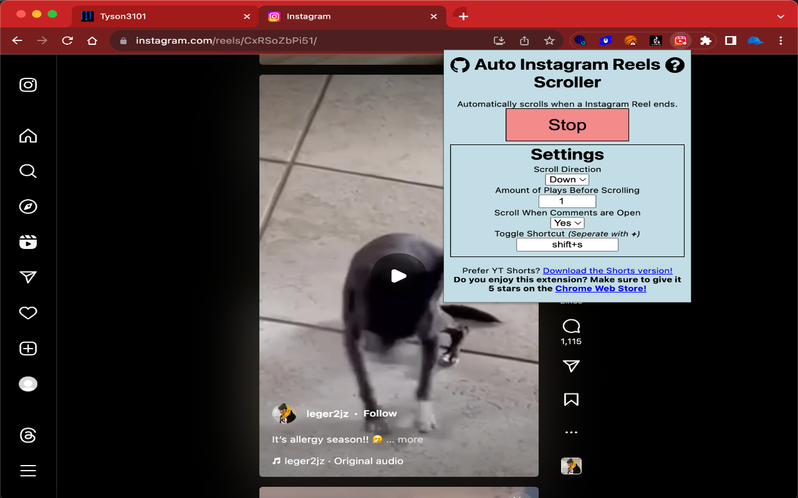

# [Auto-TikTok-Scroller](https://github.com/Tyson3101/Auto-TikTok-Scroller)

## A Chrome Extension that adds an auto-scroll feature on Instagram Reels so you can watch Reels without the need to touch your mouse.

#### Whenever a Instagram Reel ends, the extension will automatically scroll to the next one for you. Great for doing homework and watching Reeks at the same time without the need to switch tabs!

- Extension: [Click here](./README.md#extension)

- Bookmarklet: NOT YET

## Extension

**Option 1** – Install it from the [Chrome Web Store](https://chrome.google.com/webstore/detail/auto-tiktok-scroller/bpgleagdakihfeingnhnknblcfgbfcdo)

**Option 2** – Install it from source:

- Clone/download this repo,
- Open Chrome and go to `chrome://extensions`,
- Enable "Developer mode",
- Click "Load unpacked extension",
- Select the `extension` folder from this repo.

##### If you have any suggestions or experience problems, post an issue on the GitHub page: [https://github.com/Tyson3101/Auto-Instagram-Reels-Scroller/issues](https://github.com/Tyson3101/Auto-Instagram-Reels-Scroller/issues)

###### By Tyson3101
